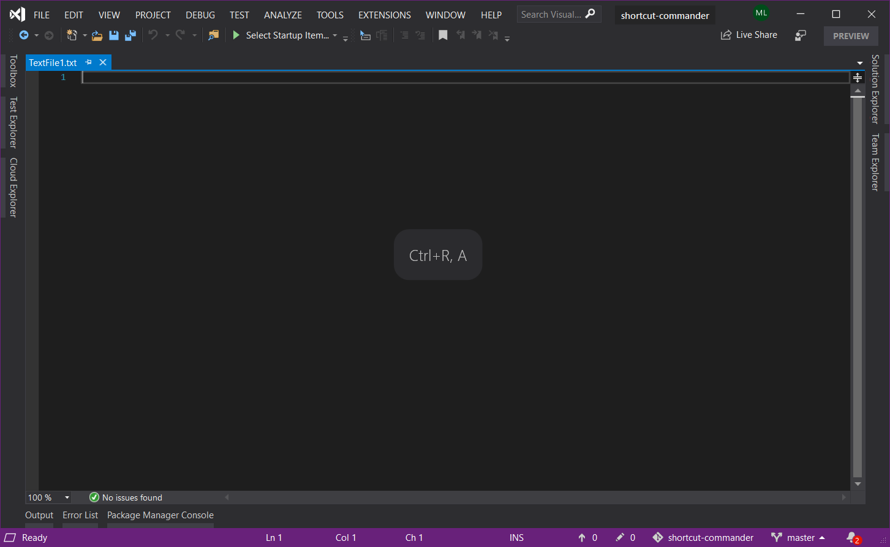

shortcut-commander
==================

A package for Visual Studio which will coach you in using hotkeys instead of the mouse, by telling you what the hotkeys for specific things are as you trigger them with your mouse.

https://marketplace.visualstudio.com/items?itemName=MathiasLykkegaardLorenzen.ShortcutCommanderVSIX

